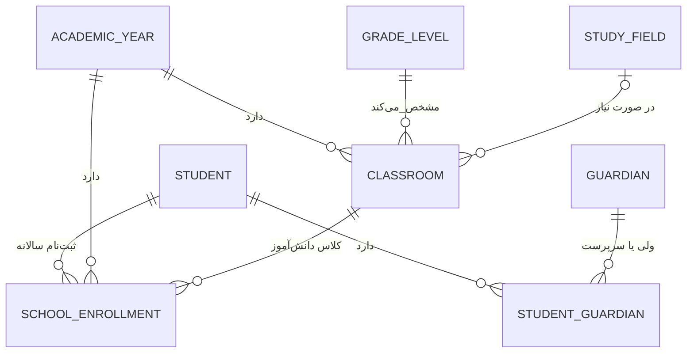

# هستهٔ مدرسهٔ دانا

هر نصب با `PRODUCT_MODE=school` فقط یک مدرسهٔ عملیاتی دارد. دیتابیس و فایل‌های آن نصب مستقل از آموزشگاه هستند؛ مدل‌های این برنامه هیچ ارتباطی با داده‌های `apps.academy` ندارند.

- `SchoolProfile` فقط یک رکورد می‌پذیرد و هویت مدرسهٔ همان نصب است.
- `Student` هویت پایدار دانش‌آموز است؛ `SchoolEnrollment` جایگاه او در سال تحصیلی و کلاس را نگه می‌دارد.
- هر دانش‌آموز می‌تواند چند ولی داشته باشد و فقط یکی ولی اصلی است.
- کلاس به سال تحصیلی و پایه وصل است؛ رشته اختیاری است تا برای همهٔ مقاطع قابل استفاده بماند.
