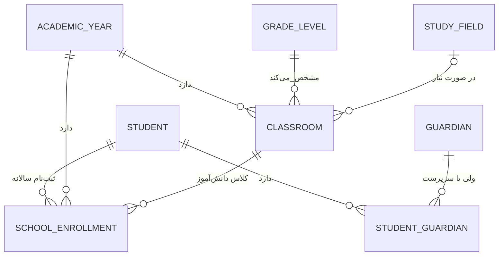

# هستهٔ پروفایل مدرسه (School Product)

قرارداد کلی: [`architecture-contract.md`](architecture-contract.md)

هر نصب با `PRODUCT_MODE=school` فقط یک مدرسهٔ عملیاتی دارد. دیتابیس و فایل‌های آن
نصب مستقل از آموزشگاه هستند؛ مدل‌های این برنامه هیچ ارتباطی با داده‌های
`apps.academy` ندارند.

- `SchoolProfile` فقط یک رکورد می‌پذیرد و هویت مدرسهٔ همان نصب است.
- `Student` هویت پایدار دانش‌آموز است؛ `SchoolEnrollment` جایگاه او در سال تحصیلی و کلاس را نگه می‌دارد.
- هر دانش‌آموز می‌تواند چند ولی داشته باشد و فقط یکی ولی اصلی است.
- کلاس به سال تحصیلی و پایه وصل است؛ رشته اختیاری است.
- پنل عملیاتی: `/school-panel/` (علاوه بر Django admin در `/admin/`).

## محدوده فعلی / معوق
پیاده‌سازی‌شده: مشخصات مدرسه، سال تحصیلی، ساختار (پایه/رشته/کلاس)، دانش‌آموز، ولی، ثبت‌نام سالانه.  
عمداً معوق در این پروفایل: حضور و غیاب، آزمون، پیامک محصولی، مالی مدرسه، پنل دبیر/دانش‌آموز جدا از staff.

## First install (handover gate)
Before a School customer install is ready for handover:

1. `install_config.py` with `PRODUCT_MODE = "school"` (explicit; not in `.env`; no silent academy default)
2. `migrate` + `createsuperuser`
3. Fill `InstallationConfig` with the school’s branding/contact
4. Create/save **SchoolProfile** (real school name) via `/school-panel/profile/` or school admin

See [`customer-first-install.md`](customer-first-install.md).

## نام‌گذاری
- **School Product** = این پروفایل (`apps.school_management`)
- **Academy Org** (`apps.schools.School`) = سازمان داخل Instance آموزشگاه — مفهومی جداست؛ با School Product یکی نیست
